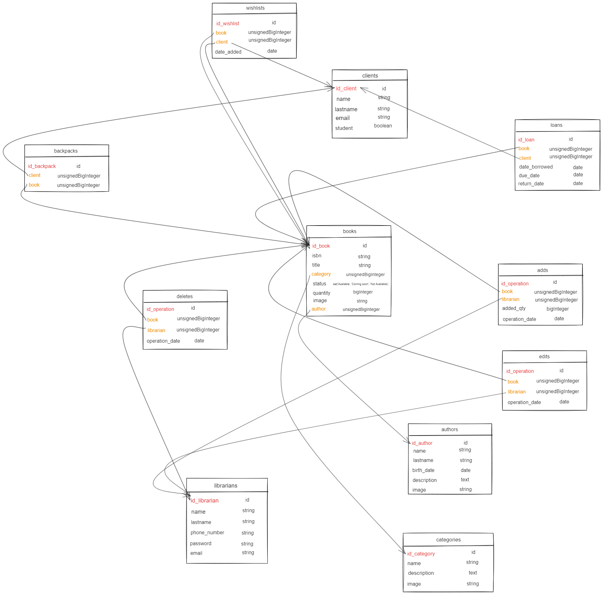

# Ohara Library

A website where clients can reserve books before picking them up physically from a real library, made with Laravel.

## Features

The website is available from two perspectives: client and librarian.

### Client Features

- Loan books
- Manage wishlisted books
- Access profile
- Search and view book authors and categories

### Librarian Features

- Export list of loans in PDF or CSV format
- Declare a loan ended by setting the date the book was returned
- Message clients via email (see SMTP configuration)
- Change due dates for loans
- Access list of clients and their loans
- Edit book information
- Remove books
- Add books to the database
- Access statistics dashboard and view visual charts

## ER Diagram



## How to Run

1. **Clone the Repository**:
   ```bash
   git clone [repository_url]
   cd [repository_name]
   ```

2. **Install Dependencies**:
   ```bash
   composer install
   ```

3. **Configure the `.env` File** with your database credentials:
   ```bash
   DB_HOST=localhost
   DB_PORT=3306
   DB_DATABASE=your_database_name
   DB_USERNAME=your_database_username
   DB_PASSWORD=your_database_password
   ```

4. **Run Migrations** to populate the database:
   ```bash
   php artisan migrate
   ```

5. **Optional: Setup SMTP Server**:
   To enable email functionality, add the following to the `.env` file:
   ```bash
   MAIL_MAILER=smtp
   MAIL_HOST=smtp.gmail.com
   MAIL_PORT=587
   MAIL_USERNAME=YOUR_EMAIL
   MAIL_PASSWORD=GOOGLE_APP_PASSWORD
   MAIL_ENCRYPTION=tls
   MAIL_FROM_ADDRESS=YOUR_EMAIL
   MAIL_FROM_NAME="Ohara Library"
   ```

6. **Serve the Application**:
   Ensure your database is running, then start the server:
   ```bash
   php artisan serve
   ```
   The app should be accessible at `http://localhost:8000`.

7. **Optional: Use Sample Data**:
   - Run the following to create the schema:
     ```bash
     php artisan migrate
     ```
   - Import data with:
     ```bash
     php artisan db:import --ignore-auto-increment
     ```
   - Download the images folder from [link], decompress it, and place it at `storage/app/public`.


